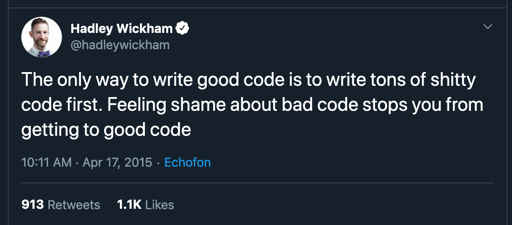

---
output:
  html_document: default
  pdf_document: default
---

```{r setup, include=FALSE}
knitr::opts_chunk$set(echo = TRUE)
```


# Introduction to R

### Hosted by: Kent State University Techology Workshops
#### March 9, 2020; 3:45pm - 5:00pm; Library 152

## Instructor:
#### Dr. Tim Assal | Assistant Professor | KSU Dept. of Geography
##### Contact: tassal@kent.edu | [timassal.com](http://www.timassal.com/) |  @[TimAssal](https://twitter.com/TimAssal)


## Workshop Goals
* Gain exposure with R/RStudio
* Learn how to import data, do something with it, then export it
* Create a basic blueprint for analysis of your own data


## Course Outline
1. Overview of R & RStudio (20 mins)
2. Packages in R (10 mins)
3. Import Data (xx mins)
4. Visualize Data (xx mins)
5. Moving Beyond Today (xx mins)


*The materials for this workshop can be accessed on [github](https://github.com/tjassal/Map-with-ggplot) or from my website [here](http://timassal.com/wp-content/uploads/2019/11/KSU_data.zip).* 


## 1. Overview of R & RStudio

#### What is R? What is RStudio? 
(notes from datacarpentry.org)

The term “R” is used to refer to both the programming language and the software that interprets the scripts written using it.

RStudio is currently a very popular way to not only write your R scripts but also to interact with the R software. To function correctly, RStudio needs R and therefore both need to be installed on your computer.

#### Why learn R?

R does not involve lots of pointing and clicking, and that’s a good thing
The learning curve might be steeper than with other software, but with R, the results of your analysis do not rely on remembering a succession of pointing and clicking, but instead on a series of written commands, and that’s a good thing! So, if you want to redo your analysis because you collected more data, you don’t have to remember which button you clicked in which order to obtain your results; you just have to run your script again.
Working with scripts makes the steps you used in your analysis clear, and the code you write can be inspected by someone else who can give you feedback and spot mistakes.
Working with scripts forces you to have a deeper understanding of what you are doing, and facilitates your learning and comprehension of the methods you use.

#### R code is great for reproducibility
Reproducibility is when someone else (including your future self) can obtain the same results from the same dataset when using the same analysis.
R integrates with other tools to generate manuscripts from your code. If you collect more data, or fix a mistake in your dataset, the figures and the statistical tests in your manuscript are updated automatically.

An increasing number of journals and funding agencies expect analyses to be reproducible, so knowing R will give you an edge with these requirements.

#### R is interdisciplinary and extensible
With 10,000+ packages that can be installed to extend its capabilities, R provides a framework that allows you to combine statistical approaches from many scientific disciplines to best suit the analytical framework you need to analyze your data. R has packages for image analysis, GIS, time series, population genetics, and a lot more.

#### R works on data of all shapes and sizes
The skills you learn with R scale easily with the size of your dataset. Whether your dataset has hundreds or millions of lines, it won’t make much difference to you.
R is designed for data analysis. It comes with special data structures and data types that make handling of missing data and statistical factors convenient.
R can connect to spreadsheets, databases, and many other data formats, on your computer or on the web.


#### R produces high-quality graphics
The plotting functionalities in R are endless, and allow you to adjust any aspect of your graph to convey most effectively the message from your data.

#### R has a large and welcoming community
Thousands of people use R daily. Many of them are willing to help you through mailing lists and websites such as Stack Overflow, or on the RStudio community.

Not only is R free, but it is also open-source and cross-platform
Anyone can inspect the source code to see how R works. Because of this transparency, there is less chance for mistakes, and if you (or someone else) find some, you can report and fix bugs.

#### Setup Instructions
R and RStudio are separate downloads and installations. R is the underlying statistical computing environment, but using R alone is no fun. RStudio is a graphical integrated development environment (IDE) that makes using R much easier and more interactive. You need to install R before you install RStudio.

* For detailed instructions, see Data Carpentry's [excellent notes](https://datacarpentry.org/R-ecology-lesson/)

### Getting around RStudio

In my opinion, RStudio is the easiest and most efficient way to use R. It's well worth it to take the time to get comfortable with it. 

RStudio has four panes:


#### R as a calculator

R works just like a calculator

Type 10 + 2 into the console and hit enter

```{r}
10 + 2
```

We can do the same with other operators (note: use * for multiplication, not x).

We are not limited to two numbers … we can use as many as you like. 

Type 10 + 2 - 8 / 43 and press Enter

```{r}
8 + 2 - 10 / 43
```

These operations follow the general laws of arithmetic (e.g. multiplication and division first, followed by addition and subtraction).

#### Although this arithmetic is all very useful, why use R to do it? 
R is a programming language and often the reason we use a programming language as opposed to a calculator is to automate some process or avoid unnecessary repetition.

In this case, we may want to use our result from above in a second calculation. Instead of retyping 10 + 2 every time we need it, we can just create a new variable that stores the result.

The way you assign a value to a variable in R is by using the assignment operator, which is just a ‘less than’ symbol followed by a ‘minus’ sign. It looks like this: <-

Think of the assignment operator as an arrow. You are assigning the value on the right side of the arrow to the variable name on the left side of the arrow.

To assign the result of 10 + 2 to a new variable called x, you type x <- 10 + 2. This can be read as ‘x gets 10 plus 2’. Give it a try now. What happened?

```{r}
x <- 5 + 7
```

You’ll notice that R did not print the result of 12 this time. When you use the assignment operator, R assumes that you don’t want to see the result immediately, but rather that you intend to use the result for something else later on. R stores the variable x and its contents in the memory for this R session.

To view the contents of the variable x, just type x and press Enter. Try it now.

```{r}
x
```

This ability to store variables, or objects, and their contents is very useful. It allows us to pass these variables to other calculations, as well as store the output as a different variable.

Now, store the result of x - 3 in a new variable called y.

```{r}
y <- x - 3
```
What is the value of y? Type y to find out.
```{r}
y
```


## 2. Packages in R 

A package is a fundamental unit of reproducible R code. They include reusable functions, the documentation that describes how to use them and typically sample data. Packages in R are basically sets of additional functions that let you do more stuff. The functions we've been using so far, like `str()` or `data.frame()`, come built into R; packages give you access to more of them. Before you use a package for the first time you need to install it on your machine, and then you should import it in every subsequent R session when you need it. 

You can install a package in RStudio in two ways:

+ Tools/Install Packages/then search for the name of the package
+ use the `install.packages()` function

Today we are going to use a package called the "tidyverse" which is actually a collection of packages designed to work together. This package is recognized by many in the field as being at the forefront of data wrangling. We'll barely scratch the surface, but I think it's important that you learn some of these capabilities. Then if needed, you'll be able to dig in and explore more in your own work. 

Once you install a package, you will not be able to use the functions, objects, and help files in a package until you load it with library(). Once you have installed a
package, you can load it with the library() function at the beginning of your code file:

```{r, results='hide'}
library(tidyverse)  #this command will show you the libraries that are loaded
```


## 3. Import Data 

Today we will work with the famous iris data set (collected by Edgar Anderson in 1935). This is a built-in data set available in R. These built in data sets are very helpful for examples. **However, I want all of you to understand how to load data into R, so please download the data [here](http://www.timassal.com/wp-content/uploads/2020/03/iris.csv).**  

+ At this point, we have two options: 
  + tell R where it is using
  + change the working directory to where it is - "hardwire it" using setwd()
    
**Best Practice - have working directory automatically set to a common place and use relative paths**

#### Projects

+ Think of each project as a self-contained unit in a single folder/directory
+ Treat all locations as relative to that single directory
+ To do this in RStudio we use projects
  + File -> New Project -> New Directory -> New Project -> RIntro
  + This is now your working directory
+ Or use Existing Directory to choose an existing directory
+ Creates .Rproj file
  + Isn’t project itself
  + Contains project info
  + Don’t change manually
+ Get the data we'll use for the day:
  + Go into windows explorer (or finder on a mac) and create a directory called "SourceData" and another one called "DerivedData" in the Directory "RIntro"
  + Then place the "iris.csv" file into the SourceData directory

Once your project is set up, reload the `tidyverse` package:

```{r, results='hide'}
library(tidyverse)  #this command will show you the libraries that are loaded
```

then load the data:

```{r, results='hide'}
iris.df <- read_csv("SourceData/iris.csv")
```


This creates a dataframe called `iris.df`. A dataframe is used for storing data tables. It is a list of vectors of equal length. We can create a dataframe from scratch by combining multiple vectors of equal length. However, it is much more common to work with dataframes that are input from an existing table, which we did here. 

View the dataframe: 

```{r, results='hide'}
view(iris.df)
```

However, dataframes are often very large so let's get familiar with programatic functions to view a particular dataframe. 

View the first few rows of the dataframe:

```{r, results='hide'}
head(iris.df)
```

or more details about the structure of the dataframe:

```{r, results='hide'}
str(iris.df)
```

`head()` and `str()` are built in functions. To get help about a function simply type:

```{r, results='hide'}
?str() #the bottom right box in RStudio will display the help
```

#### Create a new attribute

Suppose we want to create a new identifier named “IDENT” that will contain the letter A-# (e.g. “A-1”) using the the `paste()` and `nrow` functions along with the `$` operator:

```{r, results='hide'}
iris.df$IDENT<-paste("A", sep="-", 1:nrow(iris.df))
```

Have a look at the new attribute:
```{r, results='hide'}
head(iris.df)
```

Once you become an R pro, you'll never want to export your data, but in case you need to:
```{r, results='hide'}
write_csv(iris, "DerivedData/iris_out.csv")
```

Notice, we exported the data to the "DerivedData" directory. Have a look at the data in Windows Explorer or Finder. 

R is an incredibly powerful tool for working with data - e.g. reformatting data, subsetting data, massaging data, etc. collectively referred to as data wrangling - to get it into the format you need for analysis. This is an important and often time consuming step. 


## 4. Visualize Data 

Visualizing your data in a number of different ways allows you to determine the distribution or shape of the data which is helpful as you move into your statistical analysis. This exercise also forces you to find mistakes in the data or spurious values.

`BaseR` has a number of plot capabilities with no frills:

```{r}
#Plot a histogram
hist(iris$Petal.Length, main="Histogram of Petal Length")
```

```{r}
#Plot a boxplot grouped by species
boxplot(Petal.Length~Species, data=iris,main="Boxplot by Species",xlab="Species")
```

We can also explore the relationship between sepal length and width using a simple scatter plot.
```{r}
#Plot a scatterplot
plot(iris$Petal.Width, iris$Petal.Lenth, main="Scatterplot")
```


#### Plotting with **`ggplot2`**

**`ggplot2`** is a plotting package that makes it simple to create complex plots
from data in a data frame. It provides a more programmatic interface for
specifying what variables to plot, how they are displayed, and general visual
properties. Therefore, we only need minimal changes if the underlying data change
or if we decide to change from a bar plot to a scatter plot. This helps in creating
publication quality plots with minimal amounts of adjustments and tweaking.

ggplot graphics are built step by step by adding new elements. Adding layers in
this fashion allows for extensive flexibility and customization of plots. The **`ggplot2`** package is included in the **`tidyverse`** ecosystem, so we do not need to load it.   


Let's visualize the previous scatterplot in **`ggplot2`**:

```{r}
ggplot(iris.df, aes(x = Petal.Width, y = Petal.Length)) +
  geom_point(aes(), shape = 19, color = "blue", alpha =0.4) +# alpha to fade points
  geom_smooth(method = "lm", se = FALSE, color = "black") #fit a line 
```


## 5. Moving Beyond Today

**At this point, you can conduct any number of data visualization or data analysis techniques.**

Sticking with the prior example, it seems like there is a pretty strong relationship between iris petal length and petal width. Let’s fit a model to find out!

```{r}
model1 <- lm(Petal.Length ~ Petal.Width, data = iris.df)
```

Congratulations - you just ran a regression in R using one line of code!

Next, we’ll examine the output of the model. There are a number of ways to do this, but the summary command will give you everything:

```{r}
summary(model1)
```

### **Once your data is in R, the world is your oyster!**

### Words of wisdom:



### Resources:

+ [R for Data Science](https://r4ds.had.co.nz/) by Hadley Wickham and Garrett Grolemund **open source text**.

+ When in doubt, use the google!

### Good luck!

